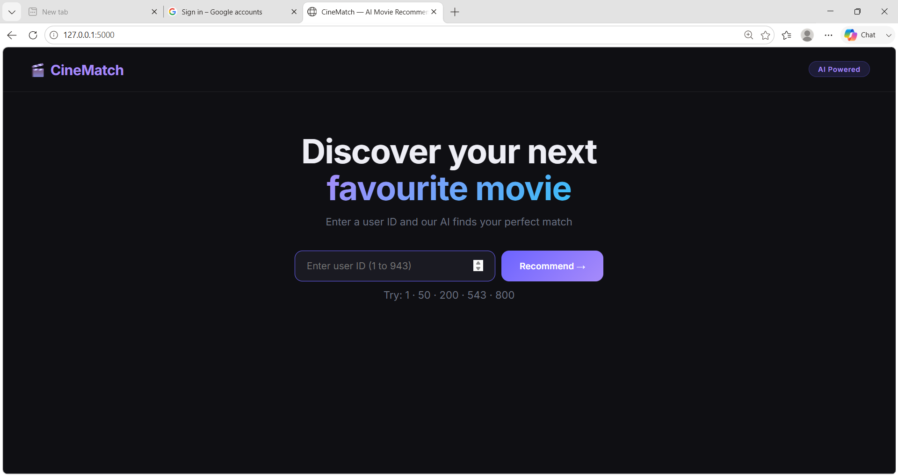
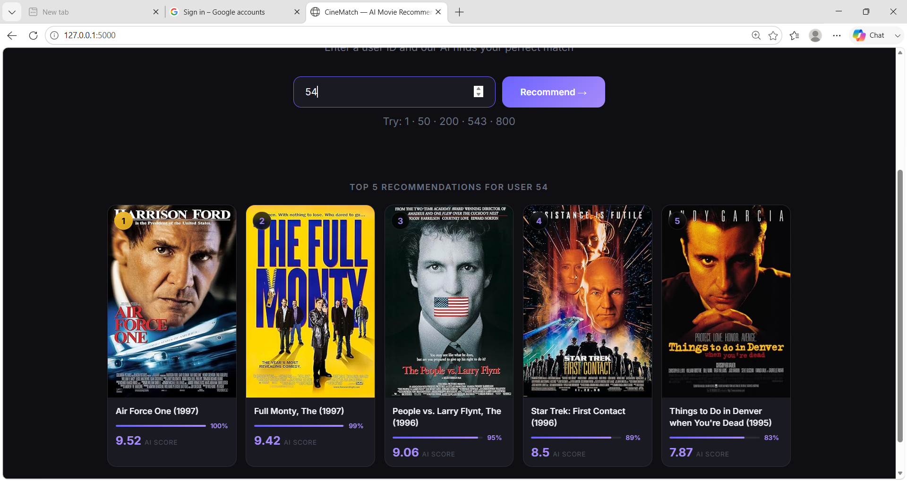
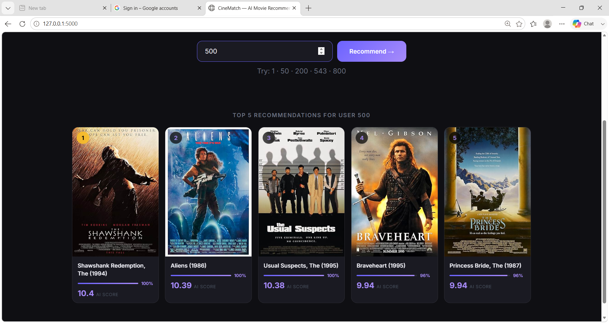

# 🎬 CineMatch — AI Movie Recommendation System

An AI-powered movie recommendation system built using 
Collaborative Filtering and Cosine Similarity.

## screenshot

## How it works

- Loads 100,000 real movie ratings from MovieLens dataset
- Builds a 943 × 1682 user-item matrix
- Uses Cosine Similarity AI to find users with similar taste
- Recommends top 5 movies with real posters from OMDb API

## Tech Stack

- Python
- Flask
- Pandas
- Scikit-learn (Cosine Similarity)
- OMDb API (movie posters)
- HTML + CSS + JavaScript

## Setup Instructions

### Step 1 — Clone the project
git clone https://github.com/YOURUSERNAME/movie-recommendation-system.git
cd movie-recommendation-system

### Step 2 — Install libraries
pip install -r requirements.txt

### Step 3 — Download the dataset
Download MovieLens 100K from:
https://grouplens.org/datasets/movielens/100k/

Unzip it and place the ml-100k folder inside the project folder.

### Step 4 — Run the app
python app.py

### Step 5 — Open browser
http://127.0.0.1:5000

## Project Structure

movie-recommendation-system/
    templates/
        index.html
    screenshots/
        home.png
        results.png
    app.py
    requirements.txt
    README.md

## Built by
Nandhini — AI Internship Project
